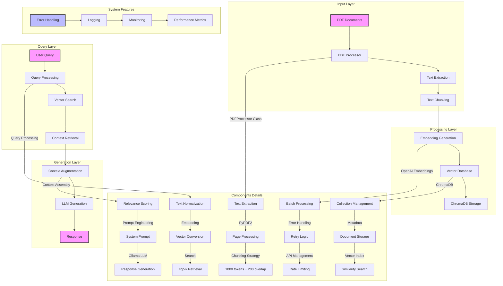

```mermaid
graph TD
    subgraph "Input Layer"
        A[PDF Documents] --> B[PDF Processor]
        B --> C[Text Extraction]
        C --> D[Text Chunking]
    end

    subgraph "Processing Layer"
        D --> E[Embedding Generation]
        E --> F[Vector Database]
        F --> G[ChromaDB Storage]
    end

    subgraph "Query Layer"
        H[User Query] --> I[Query Processing]
        I --> J[Vector Search]
        J --> K[Context Retrieval]
    end

    subgraph "Generation Layer"
        K --> L[Context Augmentation]
        L --> M[LLM Generation]
        M --> N[Response]
    end

    subgraph "Components Details"
        B --> |"PDFProcessor Class"| B1[Text Extraction]
        B1 --> |"PyPDF2"| B2[Page Processing]
        B2 --> |"Chunking Strategy"| B3[1000 tokens + 200 overlap]

        E --> |"OpenAI Embeddings"| E1[Batch Processing]
        E1 --> |"Error Handling"| E2[Retry Logic]
        E2 --> |"API Management"| E3[Rate Limiting]

        F --> |"ChromaDB"| F1[Collection Management]
        F1 --> |"Metadata"| F2[Document Storage]
        F2 --> |"Vector Index"| F3[Similarity Search]

        I --> |"Query Processing"| I1[Text Normalization]
        I1 --> |"Embedding"| I2[Vector Conversion]
        I2 --> |"Search"| I3[Top-k Retrieval]

        L --> |"Context Assembly"| L1[Relevance Scoring]
        L1 --> |"Prompt Engineering"| L2[System Prompt]
        L2 --> |"Ollama LLM"| L3[Response Generation]
    end

    subgraph "System Features"
        O[Error Handling] --> P[Logging]
        P --> Q[Monitoring]
        Q --> R[Performance Metrics]
    end

    style A fill:#f9f,stroke:#333,stroke-width:2px
    style H fill:#f9f,stroke:#333,stroke-width:2px
    style N fill:#f9f,stroke:#333,stroke-width:2px
    style O fill:#bbf,stroke:#333,stroke-width:2px
``` 